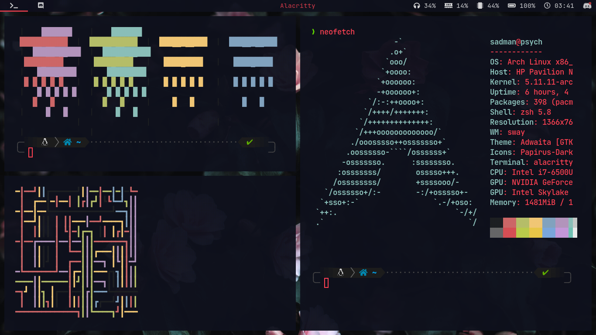

# swaywm
My swaywm configuration files. Highly recommended if you are interested in *wayland* and own a full AMD rig. 

Don't mind the icons couldn't figure out why they are too small.

## Required packages:

1. Sway as window manager
2. Waybar for topbar as replacement of polybar
3. Wofi as application launcher as replacement of rofi

